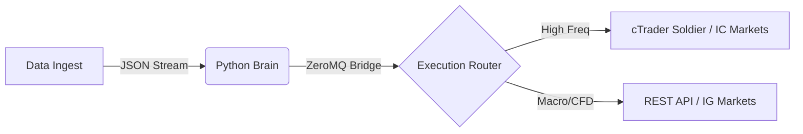

# Overlord: Hybrid Algorithmic Trading Architecture

## 📋 Executive Summary
> **Overlord** is a hybrid quantitative trading system designed to bridge the gap between **Institutional Market Data** (Futures Volume/Sentiment) and **Retail Execution**.

Unlike standard retail bots that rely on lagging technical indicators, Overlord acts as a "Market Intelligence Hub." It aggregates raw volume data from external sources, processes it through a Python-based logic engine, and routes execution commands to the optimal venue based on liquidity and cost.

---

## 🏗️ System Architecture

The system operates on a **Publisher/Subscriber (Pub/Sub)** model using **ZeroMQ** to ensure sub-millisecond latency between the Python Intelligence layer and the C# Execution layer.

### 1. The Intelligence Engine ("The Brain")
* **Language:** Python 3.10 (`pandas`, `yfinance`, `socket`)
* **Function:** Aggregates Volume and Sentiment data.
* **Logic:** Calculates **RVOL (Relative Volume)** to filter out "fake-outs" and low-liquidity traps.
* **Output:** Generates a binary `GO / NO-GO` signal broadcast via local TCP port 5555.

### 2. The Execution Module ("The Soldier")
* **Language:** C# (.NET / cAlgo API)
* **Function:** Listens to the Python signal and manages Inventory.
* **Stealth Mode:** Implements "Virtual Stop Losses" client-side to prevent broker stop-hunting.

---

## 🛡️ Risk & Governance Protocols
As a system designed by a **CPA**, risk management is hard-coded into the architecture:

1.  **Circuit Breakers:** Trading is automatically halted if daily drawdown exceeds **2.0%**.
2.  **Data Integrity:** If the Python data feed is interrupted, the Execution Module defaults to "Defensive Mode" (Close All).
3.  **Reconciliation:** Automated scripts reconcile NAV and cash positions across brokers before the session open.

---

## 🛠️ Technical Stack

| Component | Technology | Use Case |
| :--- | :--- | :--- |
| **Data Ingest** | `yfinance`, `BeautifulSoup` | Scraping volume & sentiment |
| **Logic Core** | `Python 3.10`, `Pandas` | Data normalization & Signal generation |
| **Messaging** | `ZeroMQ` (TCP) | Inter-process communication |
| **Execution** | `C#`, `cAlgo` | Order placement & Trade management |

---
**Author:** Michael Buggy (CPA)
*Institutional-Grade Logic for Private Capital.*

